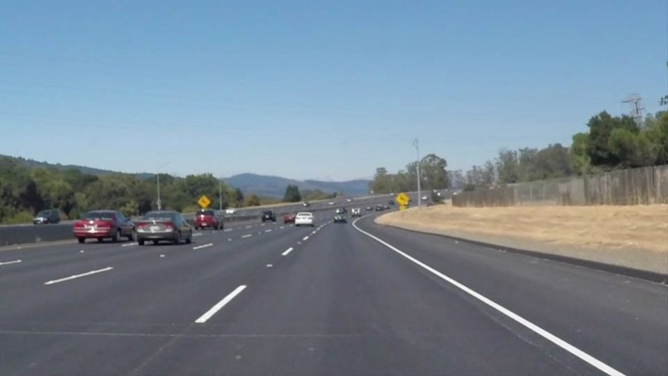
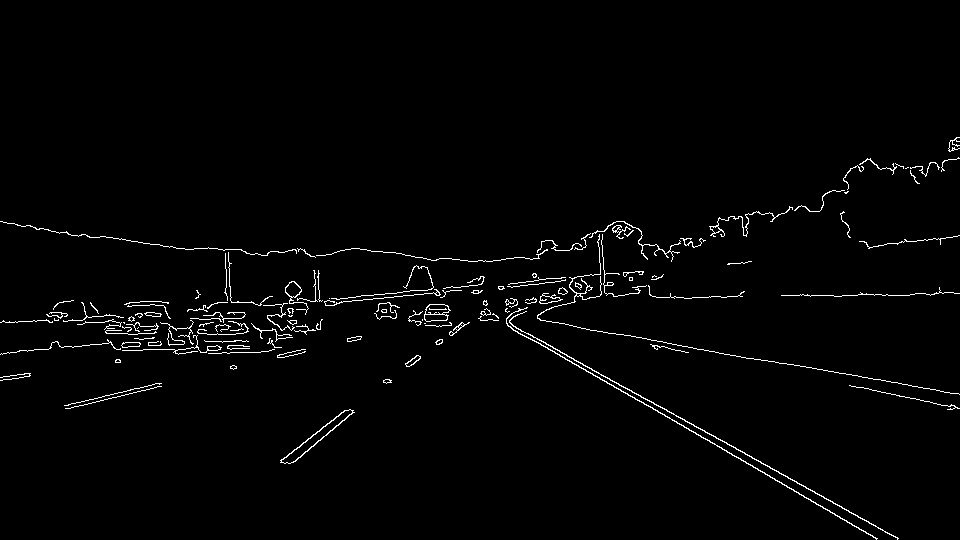
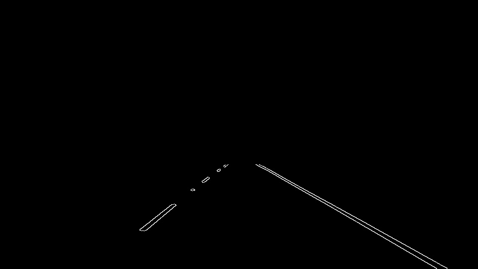
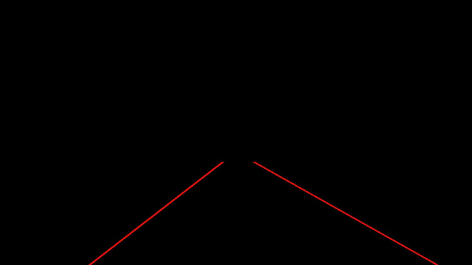
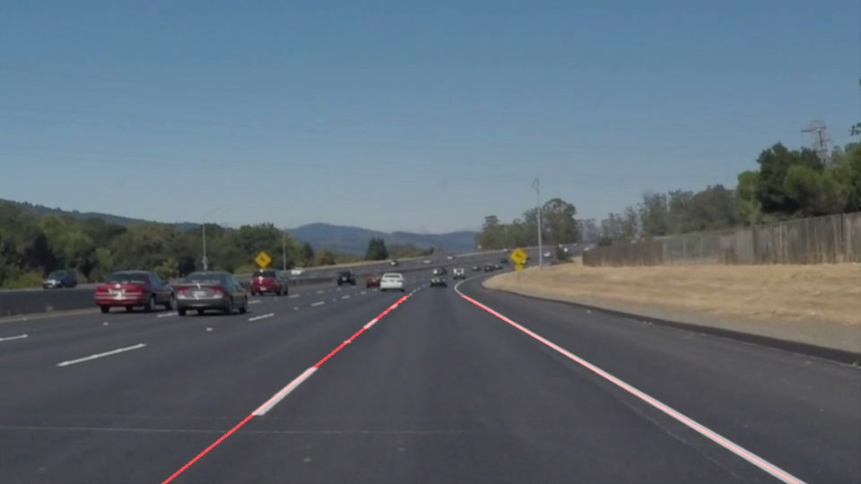

# **Finding Lane Lines on the Road**

---

**Finding Lane Lines on the Road**

The goals / steps of this project are the following:
* Make a pipeline that finds lane lines on the road
* Reflect on your work in a written report

---

### Reflection

### 1. Describe your pipeline. As part of the description, explain how you modified the draw_lines() function.

My pipeline consisted of 6 steps. First, I converted the images to grayscale. Then I apply the GaussianBlur function to the images in order to depress noise. Third, I use Canny Edge Detection algorithm to detect the edges for images. Fourth, I apply a region mask defined by the vertices of a quadrilateral to crop the images. Fifth, I run Hough Transform to detect lines for the cropped images, and use the draw_lines() function to draw the left and right straight lane lines. Last, I use cv2.addWeighted() function to draw the lane lines on the original images.

In order to draw a single line on the left and right lanes, I modified the draw_lines() function by seperating line segments by their slope (y2-y1)/(x2-x1) and their center coordinate to decide which line segments are part of the line vs. the right line. Then I average the position and slope of each of theline segments and extrapolate to the top and bottom of the lane.

The following images can show how the pipeline works:

    

    Figure 1. Original Image

    

    Figure 2. Gaussian Blur Grayscaled Image 

    

    Figure 3. Canny Edge Detection

    

    Figure 4. Apply Region of Interest Mask to Crop the Image

    

    Figure 5. Apply Hough Transform to Detect Lines For the Cropped Images

    

    Figure 6. The Final Result--Draw Lane Lines on the Original Image

I use this pipeline can successfully detect lane lines in the "solidWhiteRight.mp4" and "solidYellowLeft.mp4" videos. But when I apply it to the "challenge.mp4" video, it doesn't work.

So I modify the pipeline to overcome this obstacle.In the optional "challenge.mp4" video,we need to overcome the different lightness and shadow obstacle to successfully detect the lane lines. I use the HLS color space instead of RGB color space.I use the Saturation channel data instead of grayscaled image. I also modify the vertices of region mask because the video resolution is higher than others.

Finally, I've detected the lane lines in the challenge.mp4 video successfully in general,Though there is a little trick when handling the shadow of trees.

### 2. Identify potential shortcomings with your current pipeline

One potential shortcoming would be the pipeline could draw some strange lane lines when there are some shadows of trees or others in the test images.

Another shortcoming could be the pipeline might sometimes miss the yellow lane lines when the lightness vary. So in the "challenge.mp4" video test, I use HLS color space instead of RGB space to basically solve this problem.

### 3. Suggest possible improvements to your pipeline

A possible improvement would be to use advanced OpenCV techniques, such as Sobel operator, HLS or HSV color spaces and so on.

Another potential improvement could be to use Convolutional Neural Network or other Deep Learning methods to create a semantic segmentation solution for detecting lane lines.